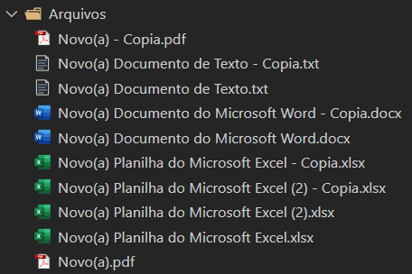
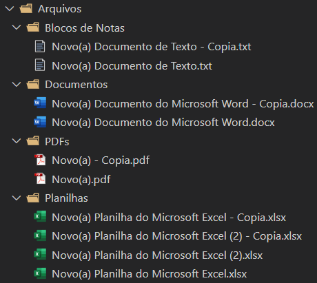

# **Organização Automática de Arquivos 📂**

Este projeto realiza a organização automática de arquivos dentro de uma pasta selecionada, classificando-os de acordo com seu formato (imagens, planilhas, documentos, PDFs, etc.).

## **📌 Funcionalidades**

1. O usuário seleciona uma pasta que contém os arquivos a serem organizados.
2. O script analisa a extensão de cada arquivo e os move para pastas correspondentes, como:
   - Imagens (.png, .jpg, .jpeg)
   - Planilhas (.xlsx)
   - PDFs (.pdf)
   - Documentos (.docx)
   - Blocos de Notas (.txt)
   - CSVs (.csv)
3. Se a pasta correspondente não existir, ela será criada automaticamente.
4. Os arquivos são movidos para suas respectivas categorias, deixando a pasta mais organizada.

## **✅ Antes e Depois**

#### 📌 Antes da organização:



#### 📌 Depois da organização:



## **🚀 Como executar?**

### Pré-requisitos

- Ter o Python 3.x instalado.

### Passos para execução

1. Baixe ou clone este repositório:

```bash
git clone https://github.com/Lucas-p00/file-organizer.git
```

2. Execute o script Python:

```bash
python main.py
```

3. Selecione a pasta que deseja organizar quando a janela for aberta.

`Observação: Podem ser adicionadas novas extensões de arquivos, basta modificar no arquivo main.py. `

## **🛠️ Tecnologias e Bibliotecas Utilizadas**

- **Python** – Linguagem de programação principal.
- **Tkinter** – Para a seleção da pasta.
- **OS** – Para manipulação de arquivos e diretórios.
